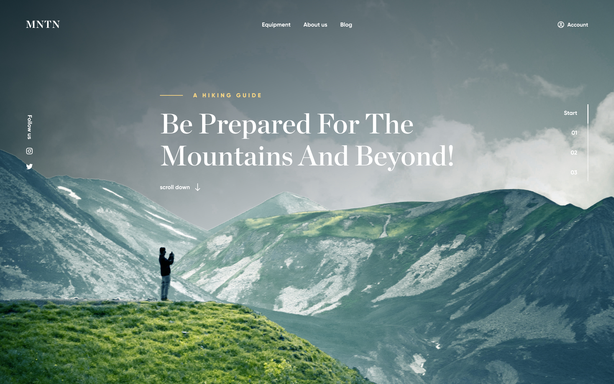

# MNTN Sport Landing

A landing page for MNTN, a brand dedicated to mountain sports and outdoor adventures.

## 🖼️ Preview



## 🔗 Demo

**[View Online](https://szubyrka.github.io/mntn-sport-landing/)**

## 🚀 Features

- Pixel-perfect layout based on the provided static design
- Modern HTML5 & CSS3 structure with clean, maintainable code
- JavaScript-powered parallax effect for immersive scrolling experience
- Focus on mountain sports theme with engaging visual storytelling
- Static, non-responsive design (intended for desktop view only)

## 📁 Project Structure

```
├── index.html
├── assets/
│   ├── images/
│   ├── fonts/
│   └── styles/
├── README.md
└── LICENSE
```

## 🛠️ Technologies Used

- HTML5
- CSS3
- JavaScript

## 📌 Notes

- This project is created solely for educational and demonstration purposes.
- All images are taken from the [Figma design mockup](https://www.figma.com/file/A0k70v2BgEDGHToBBb9TW9/Сайт-о-горном-спорте?node-id=0%3A1&mode=dev).

## 📄 License

This project is licensed under the [MIT License](./LICENSE).

## 📬 Contacts

If you'd like to get in touch:

- GitHub: [@szubyrka](https://github.com/szubyrka)
- Email: [szubyrka@gmail.com](mailto:szubyrka@gmail.com)
